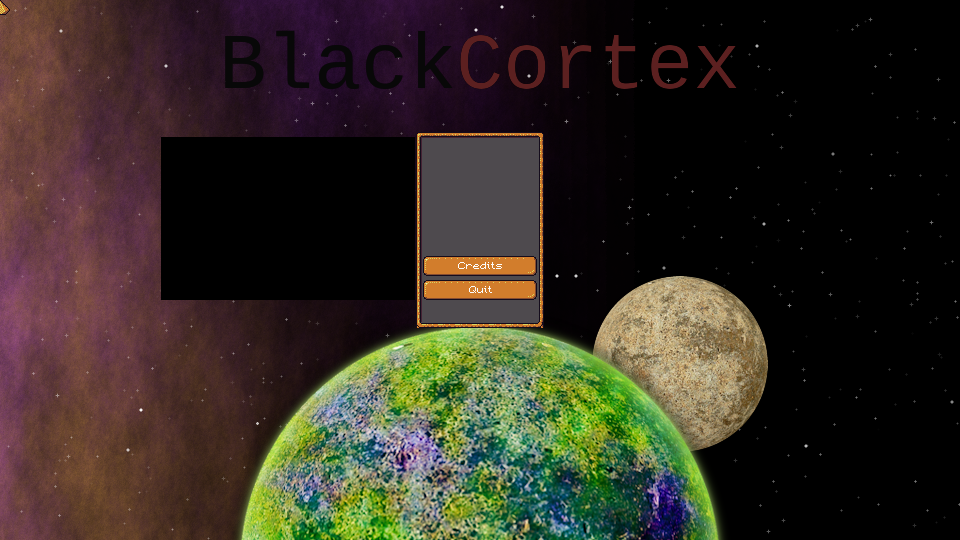

!This asset pack is not finished yet!

This is an asset replacement meant for https://github.com/liberated-cortex/CCOSS.



The goal is to make the game playable with this replacement, it's not meant as a full replacement for Cortex Command.

It's also diserable to reach a stage, where standalone mods can build upon this.

All code is licensed under MIT license.

See [attribution.md](./attribution.md) for graphics, sounds and music attributions. (Currently all are cc0 licensed)

Some images have to be converted from PNG to BMP.
You need to have imagemagick installed for this.

## Build

Converting is done with:
```
$ make
```

## Status

* Crash free until main menu
* GUI is not usable, all buttons stacked at one place
* All game editors don't crash on startup
* Choosing tutorial when selecting campaign crashes

## How does a mod know if blackCortex is running?

`rte.blackCortex` contains the version number of blackCortex

```lua
dofile("Base.rte/Constants.lua")
if rte.blackCortex then
    print("blackCortex v" .. rte.blackCortex .. " is running")
end
```
